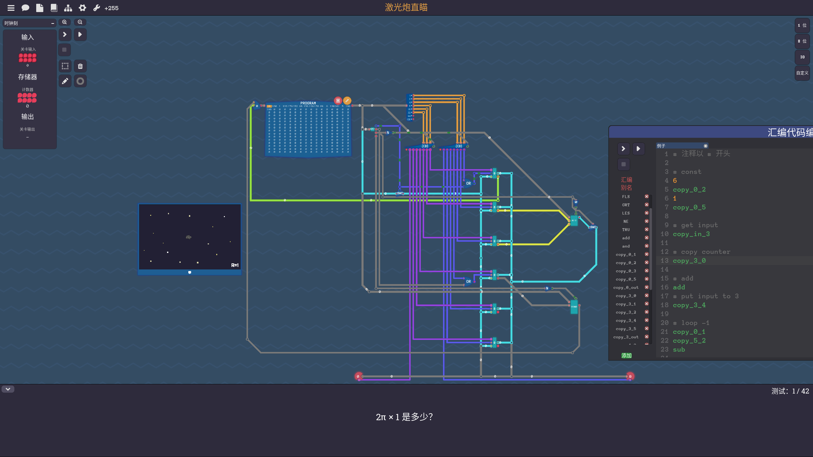

# 簡報大綱

> 要點：介紹電腦的歷史、組成、運作原理、軟體與硬體的關係

> 上半節

---

## 電腦簡介

- 各種工業和娛樂裝置的控制系統
- 根據圖靈機理論，一部具有著基本功能的電腦，應當能夠完成任何其它電腦能做的事情。

自古以來，簡單的手動裝置——就像算盤——幫助人們進行計算。
在工業革命初期，各式各樣機械的出現，初衷都是為了自動完成冗長而乏味的任務，例如織機的編織圖案。
更複雜的機器在 20 世紀初出現，通過類比電路進行複雜特定的計算。
第一台數位電腦出現於第二次世界大戰期間。
自那時以來，電腦的速度，功耗和多功能性則不斷增加。
在現代，機械電腦的應用已經完全被電腦所取代。

[電腦的歷史](../電腦歷史.md)

## 電腦的運作原理

[馮諾依曼架構](../馮諾依曼架構.md)

### 計算單元的運作

這一部分將深入研究電腦內部計算單元的運作原理，包括 2 進位和 bit 的概念、邏輯閘、加法器、暫存器等。

> 圖靈完備 - 儲存器 & 算數邏輯

#### 執行過程

[圖靈機](../圖靈機.md)

> 圖靈完備 - 處理器架構

##### 指令集

2進制指令碼的別稱

> 圖靈完備 - 編程

> ref [turing complete]

### CPU 的進化 (先跳過)

從真空管到微處理器，這裡將介紹電腦中央處理器（CPU）的演進過程，並討論不同架構（如 SOC、CISC、RISC）的特點和應用。

> ref: [微處理器](https://zh.wikipedia.org/zh-tw/%E5%BE%AE%E5%A4%84%E7%90%86%E5%99%A8)

電路體積的縮小

- 真空管
- 電晶體
- 集成電路
- 微處理器

---

